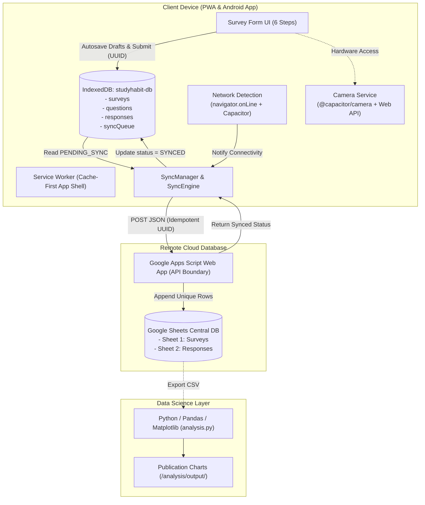

# StudyHabit — Offline-First Student Learning Habits Survey PWA

> **Ứng dụng Khảo sát Thói quen Học tập của Sinh viên** hoạt động theo kiến trúc **Offline-First**, tích hợp Progressive Web App (PWA), Service Worker Cache-First, IndexedDB, Background Sync, Google Apps Script / Google Sheets và ứng dụng native Android thông qua Capacitor.

---

## 1. Project Overview (Tổng quan dự án)

**StudyHabit** là giải pháp khảo sát hiện trường và thu thập dữ liệu xã hội học tập dành cho sinh viên đại học. Ứng dụng giải quyết triệt để bài toán mất dữ liệu khi điều tra viên hoặc sinh viên trả lời phiếu tại các khu vực sóng mạng kém, giảng đường kín, thư viện ngầm hoặc không có kết nối Internet.

Khác với các biểu mẫu Google Forms hoặc Typeform thông thường vốn đòi hỏi kết nối mạng liên tục, StudyHabit áp dụng triết lý **Offline-First**:
- Mọi dữ liệu điền phiếu đều được lưu trữ an toàn ngay lập tức vào **IndexedDB** (`studyhabit-db`).
- Mỗi phiếu nộp được cấp một mã định danh toàn cầu **UUID v4** duy nhất.
- Hàng đợi đồng bộ (**SyncQueue**) và **SyncManager** xử lý tuần tự việc gửi dữ liệu lên Google Sheets thông qua Google Apps Script ngay khi kết nối Internet được phục hồi.
- Cơ chế **Idempotency** bảo đảm việc gửi lại nhiều lần không tạo ra các dòng dữ liệu trùng lặp trên Google Sheets.

---

## 2. Problem Statement (Vấn đề thực tiễn)

Trong các nghiên cứu khoa học xã hội tại trường đại học (Social-Science Field Survey):
1. **Kết nối mạng không ổn định:** Giảng đường, hầm xe, quán cà phê hoặc khu vực ngoại thành thường xuyên bị ngắt quãng kết nối.
2. **Nguy cơ mất toàn bộ dữ liệu:** Khi đang điền biểu mẫu trực tuyến dài 20 câu hỏi, nếu trình duyệt gặp sự cố mạng hoặc vô tình tải lại trang, toàn bộ câu trả lời sẽ biến mất.
3. **Trùng lặp dữ liệu khi gửi lại:** Khi người dùng bấm nút gửi nhiều lần do mạng chậm, hệ thống truyền thống dễ tạo ra các bản ghi trùng lặp gây sai lệch kết quả thống kê.

StudyHabit loại bỏ hoàn toàn các rủi ro trên thông qua lưu trữ cục bộ kiên cố và đồng bộ thông minh.

---

## 3. Key Features (Tính năng nổi bật)

- 📱 **Progressive Web App (PWA):** Cài đặt độc lập (Standalone) trên màn hình chính của Android, iOS, Windows, macOS; hỗ trợ hiển thị tràn viền, theme color `#0284c7`.
- ⚡ **App Shell Offline:** Service Worker áp dụng chiến lược **Cache-First** cho toàn bộ mã nguồn HTML/CSS/JS, cho phép mở và làm bài khảo sát ngay cả khi ngắt kết nối mạng hoàn toàn.
- 💾 **Tự động lưu bản nháp (Autosave Draft):** Lưu tự động từng câu trả lời theo thời gian thực (debounced 600ms) vào IndexedDB. Tắt trình duyệt hoặc khởi động lại máy vẫn giữ nguyên tiến độ.
- 📋 **Khảo sát Thói quen Học tập 6 Bước (20+ Câu hỏi):**
  - **Bước 1:** Thông tin cơ bản (Năm học, Ngành học, Thời gian tự học/ngày).
  - **Bước 2:** Thói quen học tập (Số ngày tự học, Khung giờ, Địa điểm, Hình thức).
  - **Bước 3:** Phương pháp học tập (Multi-choice phương pháp, Tần suất ôn bài, Kế hoạch học).
  - **Bước 4:** Mức độ tập trung & Công nghệ (Tập trung, Xao nhãng MXH, Thiết bị, Công cụ AI).
  - **Bước 5:** Giấc ngủ & Tự đánh giá (Thời lượng ngủ, Tác động thiếu ngủ, Đánh giá hiệu quả, Khó khăn, Đóng góp ý kiến, Ảnh chụp góc học tập).
  - **Bước 6:** Xem lại toàn bộ câu trả lời trước khi gửi.
- 🔄 **Động cơ Đồng bộ Thông minh (SyncEngine):**
  - Tự động phát hiện trạng thái mạng qua `navigator.onLine`, sự kiện `online`/`offline` và `@capacitor/network`.
  - Hỗ trợ **Background Sync API** (`studyhabit-sync`) với cơ chế dự phòng sự kiện `online`.
  - Gửi tuần tự, tăng `retryCount`, giữ nguyên trạng thái `PENDING_SYNC` nếu máy chủ không phản hồi — **Cam kết không bao giờ mất dữ liệu**.
- 📊 **Dashboard & Thống kê Tức thời:** Trực quan hóa số liệu tổng phiếu, tỷ lệ đồng bộ, thời gian học phổ biến, đánh giá độ tập trung, phương pháp học và mức độ xao nhãng MXH.
- 📑 **Lịch sử Phiếu gửi (My Responses):** Quản lý trạng thái từng phiếu (🟢 Đã đồng bộ, 🟡 Chờ gửi, 🔴 Thất bại, 📝 Bản nháp) cùng tính năng thử gửi lại (Retry).
- 🐍 **Phân tích Dữ liệu Chuyên sâu (Python / Pandas / Jupyter):** Đường ống làm sạch dữ liệu, xử lý khuyết thiếu, tính toán thống kê và xuất biểu đồ tương quan publication-ready tại `/analysis`.
- 📷 **Tích hợp Phần cứng Camera:** Hỗ trợ chụp ảnh góc học tập thông qua `@capacitor/camera` trên Android và HTML File API trên trình duyệt Web.

---

## 4. Architecture Diagram (Sơ đồ Kiến trúc)



### Giải thích các thành phần cốt lõi:
- **IndexedDB (`studyhabit-db`):** Cơ sở dữ liệu cục bộ chạy trực tiếp trong trình duyệt/thiết bị, lưu trữ bền vững surveys, questions, responses và syncQueue.
- **Service Worker (`sw.js`):** Bộ đệm App Shell ngoại tuyến, đánh chặn các truy vấn tài nguyên và cung cấp khả năng khởi động ứng dụng không cần mạng.
- **SyncManager:** Bộ não điều khiển tiến trình đồng bộ tuần tự, lắng nghe mạng, đăng ký Background Sync tag `studyhabit-sync`, thử lại khi lỗi và phòng ngừa trùng lặp.
- **Google Apps Script (`Code.gs`):** Tầng trung gian bảo mật (API Gateway) đóng vai trò REST API nhận dữ liệu JSON, kiểm tra trùng lặp UUID và ghi vào Google Sheets.
- **Google Sheets:** Cơ sở dữ liệu đám mây trung tâm lưu trữ toàn bộ phản hồi khảo sát của dự án.
- **Python / Pandas:** Tầng phân tích số liệu hậu kỳ sau khi thu thập dữ liệu thực địa.

---

## 5. Technology Stack (Công nghệ sử dụng)

| Tầng kiến trúc | Công nghệ | Mục đích |
| :--- | :--- | :--- |
| **Frontend Framework** | React 19 + TypeScript + Vite | Xây dựng giao diện hiệu năng cao, kiểm soát kiểu dữ liệu nghiêm ngặt |
| **Local Database** | IndexedDB (`idb` v8) | Lưu trữ ngoại tuyến bền bỉ, hỗ trợ giao dịch (transactions) và chỉ mục |
| **PWA & Offline** | Service Worker + Web Manifest | Bộ đệm App Shell Cache-First, Background Sync, Standalone Mode |
| **Remote Database** | Google Sheets | Kho lưu trữ dữ liệu trung tâm |
| **API Layer** | Google Apps Script (JavaScript V8) | RESTful API trung gian, kiểm tra Idempotency |
| **Native Mobile** | Capacitor 8 (`@capacitor/camera`, `@capacitor/network`) | Đóng gói ứng dụng di động Android native |
| **Data Analysis** | Python 3, Pandas, Matplotlib, NumPy | Phân tích thống kê, làm sạch dữ liệu, trực quan hóa biểu đồ |
| **Styling** | Modern Vanilla CSS + Glassmorphism | Giao diện học thuật, chuẩn mobile-first, mượt mà và trực quan |

---

## 6. The Offline-First Data Flow (Luồng Dữ liệu Ngoại Tuyến)

```
Người dùng nhấn "Nộp phiếu khảo sát"
               │
               ▼
   [1. Kiểm tra tính hợp lệ dữ liệu]
               │
               ▼
   [2. Khởi tạo mã UUID v4 duy nhất]
               │
               ▼
   [3. Lưu vào IndexedDB (studyhabit-db)]
   ──> Trạng thái: PENDING_SYNC
               │
               ▼
   [4. Kiểm tra trạng thái mạng]
       ├── Đang Offline:
       │     - Hiển thị thông báo: "Bạn đang offline. Câu trả lời đã được lưu và sẽ tự động đồng bộ khi có mạng."
       │     - Giữ nguyên trong hàng đợi SyncQueue.
       │
       └── Đang Online:
             - SyncManager kích hoạt gửi tuần tự.
             - Đánh dấu: SYNCING.
             - POST JSON đến Google Apps Script.
             - Thành công: Cập nhật status = SYNCED.
             - Thất bại: Giữ lại PENDING_SYNC, tăng retryCount, không bao giờ mất dữ liệu.
```

---

## 7. Google Apps Script & Google Sheets Setup (Hướng dẫn Cài đặt Backend)

1. Mở [Google Sheets](https://sheets.new) và tạo một trang tính mới đặt tên: `StudyHabit_Database`.
2. Tạo 2 sheet:
   - **Sheet 1:** Đổi tên thành `Surveys` với các cột: `id`, `surveyId`, `surveyVersion`, `createdAt`, `deviceId`, `status`.
   - **Sheet 2:** Đổi tên thành `Responses` với các cột: `id`, `surveyId`, `submittedAt`, `answers`, `deviceId`.
3. Trên menu Google Sheets, chọn **Extensions (Tiện ích mở rộng)** ➔ **Apps Script**.
4. Xóa nội dung mặc định trong tệp `Code.gs` và dán toàn bộ mã nguồn từ tệp [`google-apps-script/Code.gs`](file:///d:/Project/mobiles/week3/google-apps-script/Code.gs).
5. Bấm **Deploy (Triển khai)** ➔ **New deployment (Triển khai mới)**:
   - Chọn loại: **Web app**.
   - Description: `StudyHabit API v1`.
   - Execute as: **Me (Tôi)**.
   - Who has access: **Anyone (Bất kỳ ai)**.
6. Bấm **Deploy**, cấp quyền truy cập khi được yêu cầu, sau đó sao chép đường dẫn **Web app URL** (dạng `https://script.google.com/macros/s/.../exec`).
7. Cấu hình vào ứng dụng PWA:
   - Cách 1: Tạo tệp `.env` tại thư mục gốc dự án:
     ```env
     VITE_GOOGLE_APPS_SCRIPT_URL=https://script.google.com/macros/s/YOUR_DEPLOYED_ID/exec
     ```
   - Cách 2: Mở biểu tượng **Bánh răng Cài đặt** ở góc phải thanh Header của ứng dụng, dán URL và nhấn **Lưu cấu hình**.

---

## 8. Local Development & Installation (Hướng dẫn Chạy Dự án)

### Yêu cầu môi trường:
- Node.js >= 18.x
- npm >= 9.x
- Python >= 3.10 (cho phần phân tích dữ liệu)

### Cài đặt và khởi chạy:
```powershell
# 1. Cài đặt các gói phụ thuộc
npm install

# 2. Khởi chạy máy chủ phát triển PWA
npm run dev

# 3. Biên dịch bản production và kiểm tra kiểu dữ liệu
npm run build

# 4. Kiểm tra mã nguồn với linter
npm run lint
```

Truy cập ứng dụng tại: `http://localhost:5173`

---

## 9. Capacitor & Android Native Setup (Biên dịch Ứng dụng Android)

Dự án đã được tích hợp sẵn Capacitor với App ID `com.studyhabit.survey` và Tên `StudyHabit`.

```powershell
# 1. Biên dịch gói web
npm run build

# 2. Đồng bộ mã nguồn web và plugin vào thư mục android native
npx cap sync

# 3. Mở dự án trong Android Studio để build APK hoặc chạy trên máy ảo/thiết bị thật
npx cap open android
```

---

## 10. Python Data Analysis Setup (Phân tích Số liệu Nghiên cứu)

Thư mục `/analysis` cung cấp đường ống phân tích khoa học dữ liệu hoàn chỉnh độc lập:

```powershell
# 1. Di chuyển vào thư mục analysis
cd analysis

# 2. Cài đặt thư viện phân tích
pip install -r requirements.txt

# 3. Chạy phân tích thống kê và tự động xuất biểu đồ
python analysis.py
```

### Các biểu đồ được sinh ra trong `/analysis/output/`:
1. `study_time_distribution.png`: Phân phối thời gian tự học trung bình mỗi ngày.
2. `study_location_distribution.png`: Tỷ lệ các địa điểm học tập được ưa chuộng.
3. `learning_methods.png`: Tần suất các phương pháp học tập được sinh viên áp dụng.
4. `concentration_distribution.png`: Thang điểm mức độ tập trung (1–5 Sao).
5. `effectiveness_distribution.png`: Tự đánh giá hiệu quả thói quen học tập.
6. `study_time_vs_effectiveness.png`: Mối tương quan giữa thời lượng tự học và hiệu quả học tập.

Ngoài ra, tệp [`analysis/study_habit_analysis.ipynb`](file:///d:/Project/mobiles/week3/analysis/study_habit_analysis.ipynb) có thể được mở bằng Jupyter Lab / VS Code để trực quan hóa từng bước.

---

## 11. Testing Offline Mode & Demo Scenario (Kịch bản Trình diễn 3 Phút)

Để kiểm chứng tính năng Offline-First hoàn toàn trung thực:

1. **Bước 1: Mở ứng dụng khi có mạng:** Truy cập `http://localhost:5173` trên Google Chrome. Mở DevTools ➔ Tab **Application** ➔ Kiểm tra Service Worker đã `activated and running`, IndexedDB đã có `studyhabit-db`.
2. **Bước 2: Ngắt kết nối mạng:**
   - Trong DevTools, mở tab **Network** ➔ Chuyển từ `No throttling` sang **Offline**.
   - Thanh Header lập tức chuyển sang huy hiệu màu xám: `Offline — Lưu tại máy`.
3. **Bước 3: Thực hiện khảo sát ngoại tuyến:**
   - Bấm **"Bắt đầu điền phiếu khảo sát"**.
   - Điền thông tin qua 6 bước (Bước 1 ➔ Bước 6).
   - Thử tải lại trang (F5) khi đang offline: Bản nháp được khôi phục nguyên vẹn 100% từ IndexedDB.
4. **Bước 4: Nộp phiếu khi Offline:**
   - Nhấn **"Nộp phiếu khảo sát"**.
   - Thông báo xuất hiện: *"Đã lưu trên thiết bị — Bạn đang offline. Câu trả lời đã được lưu và sẽ tự động đồng bộ khi có mạng."*
   - Vào tab **Lịch sử (My Responses)**: Phiếu hiển thị trạng thái `🟡 Chờ gửi (Offline)` với mã UUID.
5. **Bước 5: Khôi phục kết nối mạng:**
   - Chuyển tab Network từ **Offline** về lại **No throttling (Online)**.
   - SyncManager tự động kích hoạt ngay lập tức mà không cần bấm nút F5.
   - Phiếu tự động chuyển sang trạng thái `🟢 Đã đồng bộ`.
6. **Bước 6: Kiểm tra Google Sheets:** Mở trang tính Google Sheets, bản ghi mới xuất hiện với đầy đủ câu trả lời dưới dạng JSON và mã UUID khớp chính xác.
7. **Bước 7: Kiểm tra tính Idempotency:** Bấm nút "Gửi lại" trên giao diện. Google Apps Script trả về `{ success: true, duplicate: true }` và không tạo dòng thừa.

---

## 12. Project Directory Structure (Cấu trúc Dự án)

```
week3/
├── analysis/                     # Tầng phân tích dữ liệu Python
│   ├── analysis.py               # Script phân tích & vẽ biểu đồ
│   ├── study_habit_analysis.ipynb# Jupyter Notebook phân tích EDA
│   ├── requirements.txt          # Thư viện pandas, matplotlib, numpy
│   ├── sample_responses.csv      # Dữ liệu khảo sát mẫu chuẩn Google Sheets
│   └── output/                   # 6 biểu đồ khoa học đã xuất bản (.png)
│
├── android/                      # Dự án Android Native (Capacitor)
├── capacitor.config.ts           # Cấu hình Capacitor (com.studyhabit.survey)
├── google-apps-script/
│   └── Code.gs                   # Mã nguồn Google Apps Script Web App API
│
├── public/
│   ├── icons/                    # Biểu tượng PWA (192x192, 512x512, svg)
│   ├── manifest.webmanifest      # PWA Web Manifest chuẩn
│   ├── manifest.json             # PWA Manifest tương thích
│   └── sw.js                     # Service Worker (Cache-First + Background Sync)
│
├── src/
│   ├── components/
│   │   ├── layout/               # Header, BottomNav
│   │   ├── modals/               # SettingsModal (URL GAS, IndexedDB stats)
│   │   └── survey/               # QuestionRenderer, MultiStepSurveyForm
│   ├── data/
│   │   └── studyHabitSurvey.ts   # Bộ 20 câu hỏi khảo sát thói quen học tập
│   ├── db/
│   │   ├── database.ts           # Khởi tạo IndexedDB (studyhabit-db)
│   │   ├── seedData.ts           # Dữ liệu mẫu ban đầu
│   │   └── repositories/         # surveyRepository, responseRepository, syncQueue
│   ├── services/
│   │   ├── api/                  # googleSheetsApi.ts
│   │   ├── camera/               # cameraService.ts (@capacitor/camera + Web)
│   │   ├── network/              # networkService.ts (Capacitor Network + Web)
│   │   └── sync/                 # SyncManager.ts (Động cơ đồng bộ tuần tự)
│   ├── types/                    # TypeScript definitions (Survey, Question, Response)
│   ├── styles/                   # Modern CSS design system
│   ├── App.tsx                   # Main App Router & State
│   └── main.tsx                  # React Bootstrapper & SW Registration
│
├── README.md                     # Tài liệu hướng dẫn kỹ thuật toàn diện
└── TECHNICAL_REPORT.md           # Báo cáo kỹ thuật học thuật Mini-Project
```

---

## 13. Limitations & Future Work (Hạn chế & Hướng phát triển)

### Hạn chế hiện tại:
- Google Apps Script có giới hạn thời gian thực thi (Quota execution time 6 phút/lần gọi) và giới hạn 20.000 requests/ngày cho tài khoản miễn phí.
- Background Sync API tiêu chuẩn của W3C hiện được hỗ trợ tốt nhất trên Chrome/Edge/Android, đối với trình duyệt Safari (iOS) ứng dụng tự động chuyển sang cơ chế kích hoạt bằng sự kiện `window.addEventListener("online")`.

### Hướng phát triển:
- Tích hợp nén ảnh trước khi lưu (Client-side Image Compression) để tối ưu dung lượng IndexedDB khi sinh viên chụp nhiều ảnh học tập.
- Xuất báo cáo kết quả tổng hợp định dạng PDF trực tiếp từ giao diện Dashboard.
- Hỗ trợ mã hóa đầu-cuối (End-to-End Encryption) cho các khảo sát yêu cầu tính ẩn danh cao.
